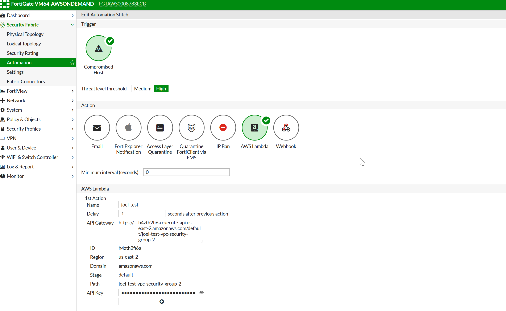

# Intro
This Lambda function works with the FortiGate automation triggers and an API gateway that, when triggered, will change the security group of a requested EC2 instance to
one set by an environment variable in Lambda called "DEFAULT_GROUP".

This README will walk through the basic setup process for this function.

# Set Up the Lambda function:
    Note: The FortiGate and Lambda function will need to be in the same region, i.e us-east-2. The FortiGate will
    automatically set the AWS region for the POST request based on the region it is set up in.

1. Create a new Lambda function and select **Author from scratch**.

    The basic settings should be as follows:

    **Name:** Create a function name<br>
    **Runtime:** Select Node.js 8.10<br>
    **Role:** The function will need basic **AWS Lambda Execution** as well as EC2 **list** and **write**<br>


      **AWSLambdaBasicExecutionRole:**

      ```
      {
        "Version": "2012-10-17",
        "Statement": [
            {
                "Effect": "Allow",
                "Action": [
                    "logs:CreateLogGroup",
                    "logs:CreateLogStream",
                    "logs:PutLogEvents"
                ],
                "Resource": "*"
            }
        ]
    }
    ```

    **EC2 Access JSON:**

    ```
    {
        "Version": "2012-10-17",
        "Statement": [
            {
                "Sid": "VisualEditor0",
                "Effect": "Allow",
                "Action": [
                    "ec2:DescribeInstances",
                    "ec2:ModifyInstanceAttribute"
                ],
                "Resource": "*"
            }
        ]
    }
   ```

2. After creating the function you will need to create an API Gateway. For security, select **Open with API key**.
3. Create an Environment Variable with the key **DEFAULT_GROUP** and for the value choose the security group that VMs will be reset to.
4. Copy the code into the Lambda function and save the function.

# Set Up the FortiGate

1. Set up your FortiGate by selecting **Security Fabric** and then **Automation**.
2. Select **Compromised Host** as the **Trigger**.
3. Select **AWS Lambda** as the **Action**. If desired, an email notification can be configured to notify you that the event has triggered.
4. Under **AWS Lambda** configure the **API Gateway** and **API key** with the settings generated by AWS in the previous section.

    The settings should look similar to the following:

    


# Support
Fortinet-provided scripts in this and other GitHub projects do not fall under the regular Fortinet technical support scope and are not supported by FortiCare Support Services.
For direct issues, please refer to the [Issues](https://github.com/fortinet/aws-lambda-vpc-security-group-update/issues) tab of this GitHub project.
For other questions related to this project, contact [github@fortinet.com](mailto:github@fortinet.com).

## License
[License](./LICENSE) © Fortinet Technologies. All rights reserved.
